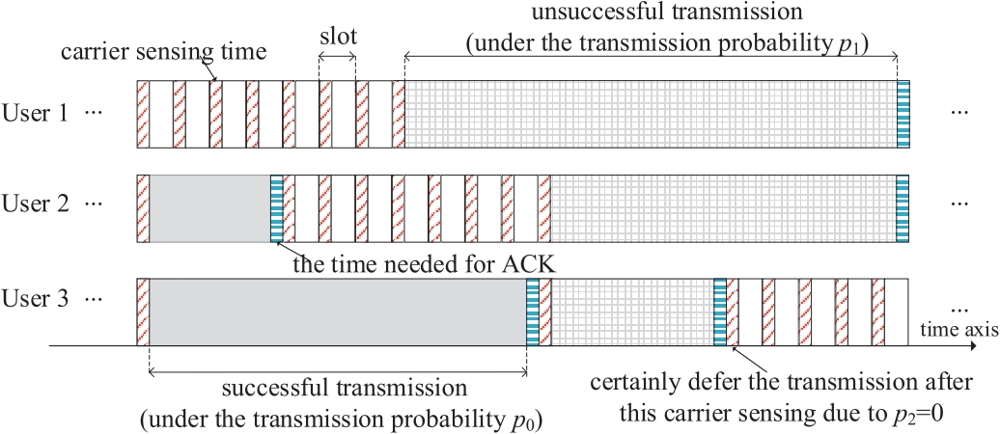

# Dynamic Optimization of Random Access in Deadline-Constrained Broadcasting

Yijin Zhang, [Aoyu Gong](https://aygong.com/), [Yuan-Hsun Lo](https://sites.google.com/view/yuanhsunlo/home), [Jun Li](http://www.deepiiotlab.com/), Feng Shu, [Wing Shing Wong](http://www.ie.cuhk.edu.hk/people/wing2.shtml)

[`IEEE`](https://ieeexplore.ieee.org/document/8776634) | [`Technical Report`](https://aygong.com/docu/pCSMAtr.pdf) | [`BibTeX`](#Citation)

<div align="center">
<p>

</p>
</div>
<table>
      <tr><td><em>Figure: An example of the working procedure of the generalized p-persistent CSMA for the case of N = 3 and c = γ = 2.</em></td></tr>
</table>

This paper considers a multiple-access system with multiple-packet reception (MPR) capability $γ$, i.e., a packet can be successfully received as long as it overlaps with $γ − 1$ or fewer other packets at any instant during its lifetime. To efficiently utilize the MPR capability, this paper generalizes $p$-persistent carrier-sense multiple access (CSMA) to consider that a user with carrier sensing capability $c$ adopts the transmission probability $p_n$ if this user has sensed $n$ ongoing transmissions for $n = 0, 1, . . . , c − 1$. This paper aims to model the characteristics of such CSMA and to design transmission probabilities for achieving maximum saturation throughput. To this end, we first formulate such CSMA as a parameterized Markov decision process (MDP) and use the long-run average performance to evaluate the saturation throughput. Second, by observing that the exact values of optimal transmission probabilities are in general infeasible to find, we modify this MDP to establish an upper bound on the maximum throughput, and modify this MDP again to propose a heuristic design with near-optimal performance. Simulations with respect to a wide range of configurations are provided to validate our study. The throughput performance under more general models and the robustness of our design are also investigated.


## Configuration

You can reproduce our experiments using **MATLAB R2021a**.

- Clone the repository: `git clone https://github.com/aygong/pcsma-asynchronous-mpr.git`

- Run the script: `main.m`

> The code may be compatible with the previous versions of MATLAB.


## Folder Structure

```
./pcsma-asynchronous-mpr/
├── README.md
|
├── main.m
├── policy_iteration.m         # Apply the policy iteration
├── throughput_analysis.m      # Analyze the network throughput
├── throughput_simulation.m    # Simulate the network throughput
├── natural_geornd.m           # Generate random natural numbers
└── policy_iteration.m         # Display the results and the error
```


## Citation

If you find the code helpful, please consider citing our paper:

```
@article{zhang2019generalized,
  title={Generalized $p$-persistent {CSMA} for asynchronous multiple-packet reception},
  author={Zhang, Yijin and Gong, Aoyu and Lo, Yuan-Hsun and Li, Jun and Shu, Feng and Wong, Wing Shing},
  journal={IEEE Trans. Commun.},
  volume={67},
  number={10},
  pages={6966--6979},
  year={2019},
}
```
